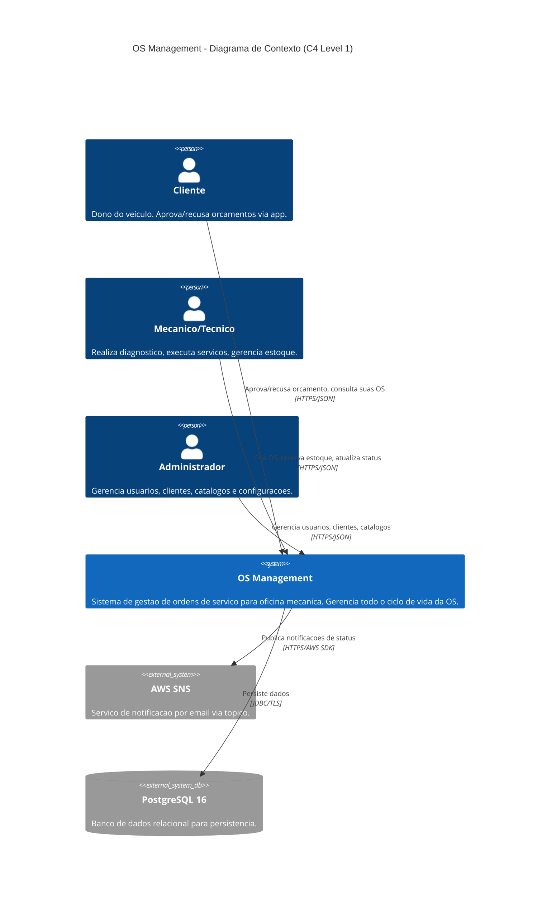
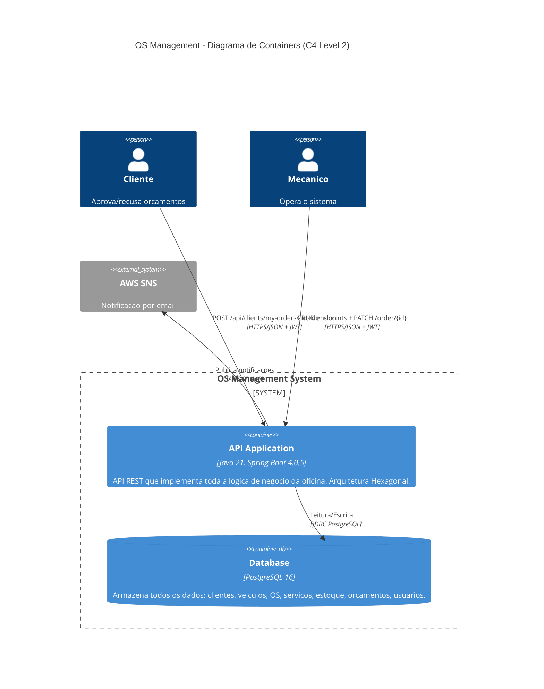
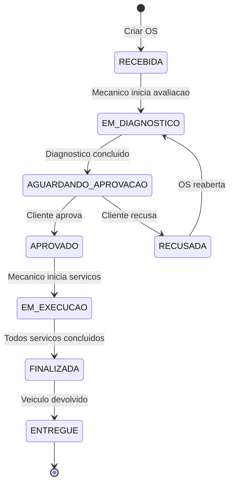

# Desenho da Arquitetura — OS Management

## C4 Model

### Nivel 1 — Context Diagram (Diagrama de Contexto)

Mostra o sistema OS Management e suas interacoes com atores externos.



#### Descricao dos Elementos

| Elemento | Tipo | Descricao |
|----------|------|-----------|
| Cliente | Pessoa | Dono do veiculo. Recebe notificacoes por email. Aprova ou recusa orcamentos via endpoint autenticado. |
| Mecanico/Tecnico | Pessoa | Profissional da oficina. Cria OS, realiza diagnostico, reserva pecas, executa servicos, atualiza status. |
| Administrador | Pessoa | Gerencia usuarios, clientes, veiculos, catalogos de pecas/insumos e configuracoes do sistema. |
| OS Management | Sistema | Aplicacao principal. API REST Spring Boot que gerencia todo o ciclo de vida da OS. |
| AWS SES | Sistema Externo | Servico da AWS para envio de emails HTML com notificacoes de mudanca de status. |
| PostgreSQL 16 | Banco de Dados | Armazena clientes, veiculos, OS, servicos, estoque, orcamentos, usuarios. |

---

### Nivel 2 — Container Diagram (Diagrama de Containers)

Mostra os containers (unidades de deploy) que compoem o sistema e suas interacoes.



#### Descricao dos Containers

| Container | Tecnologia | Responsabilidade |
|-----------|-----------|-----------------|
| API Application | Java 21, Spring Boot 4.0.5, Docker (non-root) | Toda a logica de negocio. Autenticacao JWT. Validacao. Orquestracao de fluxos. |
| Database | PostgreSQL 16, Docker | Persistencia relacional. Integridade referencial. Transacoes ACID. |
| AWS SNS | Servico gerenciado AWS | Publicacao de notificacoes de status para subscribers (email). |

---

## Componentes da Aplicacao (dentro do Container API)

### Arquitetura Hexagonal — Camadas

```
+------------------------------------------------------------------+
|                      ADAPTER IN (Web/REST)                        |
|                                                                  |
|  Controllers: Client, ServiceOrder, Vehicle, Part, Supply,       |
|  Stock, Service, Budget, Monitoring, User                        |
|  DTOs: Request/Response records                                  |
+------------------------------------------------------------------+
                              |
                              v
+------------------------------------------------------------------+
|                    APPLICATION (Use Cases)                        |
|                                                                  |
|  Use Cases: CreateOrder, UpdateOrder, DecideOrder, ListOrders,   |
|  FindOrdersByDocument, CreateClient, ReserveStock, etc.          |
|  Event Listeners: BudgetEventListener, StockRejectionListener    |
|  Notification: OrderStatusNotificationService                    |
|  Port Interfaces (OUT): ClientRepository, ServiceOrderRepository,|
|  StockRepository, VehicleRepository, EmailNotificationPort       |
+------------------------------------------------------------------+
                              |
                              v
+------------------------------------------------------------------+
|                         DOMAIN                                   |
|                                                                  |
|  Entities: ServiceOrder (rich), Client, Vehicle, Stock, Budget   |
|  Value Objects: Document (CPF/CNPJ), LicensePlate                |
|  Enums: OrderServiceStatusEnum, Decision, DocumentType           |
|  Events: OrderRejectedEvent, ReservationChangedEvent             |
|  Exceptions: InvalidStatusTransitionException, ClientNotFound    |
+------------------------------------------------------------------+
                              |
                              v
+------------------------------------------------------------------+
|                    ADAPTER OUT (Persistence)                      |
|                                                                  |
|  Persistence Adapters: ClientPersistenceAdapter,                 |
|  ServiceOrderPersistenceAdapter, StockPersistenceAdapter, etc.   |
|  Mappers: ClientMapper, VehicleMapper, StockMapper (MapStruct)   |
+------------------------------------------------------------------+
                              |
                              v
+------------------------------------------------------------------+
|                     INFRASTRUCTURE                                |
|                                                                  |
|  JPA Entities: ClientEntity, ServiceOrderEntity, StockEntity...  |
|  Security: JwtFilter, JwtService, SecurityConfig                 |
|  Notification: SesEmailService, EmailTemplateRenderer, SesConfig |
|  Config: GlobalExceptionHandler, AsyncConfig                     |
+------------------------------------------------------------------+
```

### Modulos de Dominio

| Modulo | Responsabilidade | Entidades Principais |
|--------|-----------------|---------------------|
| ServiceOrder | Ciclo de vida da OS com maquina de estados | ServiceOrder, OrderServiceStatusEnum, Decision |
| Client | Cadastro de clientes com CPF/CNPJ | Client, Document, Cpf, Cnpj |
| Vehicle | Cadastro de veiculos | Vehicle, LicensePlate, VehicleType |
| Product | Catalogo de pecas e insumos | Product (abstract), Part, Supply |
| Stock | Controle de estoque e reservas | Stock, StockMovement, StockReservation |
| Budget | Orcamento automatico | Budget, BudgetItem |
| Service | Servicos dentro da OS | WorkshopService, ServiceType, Status |
| Monitoring | Metricas de performance | ServiceAverageTime, AverageTimeEnum |
| User | Autenticacao e autorizacao | User, Role, Group |
| Notification | Envio de emails | EmailNotificationPort, SesEmailService |

### Fluxo Principal — Ciclo de Vida da OS



### Comunicacao entre Componentes

| Origem | Destino | Mecanismo | Descricao |
|--------|---------|-----------|-----------|
| DecideOrderUseCase | StockRejectionEventListener | Spring Event (sincrono) | Ao recusar, publica OrderRejectedEvent |
| StockRejectionEventListener | ReleaseReservationUseCase | Chamada direta | Libera reservas ACTIVE da OS |
| ReserveStockUseCase | BudgetEventListener | Spring Event (sincrono) | Ao reservar, publica ReservationChangedEvent |
| BudgetEventListener | RecalculateBudgetUseCase | Chamada direta | Recalcula orcamento |
| UpdateOrderUseCase | OrderStatusNotificationService | Chamada direta | Notifica cliente |
| OrderStatusNotificationService | SesEmailService | Via port interface (@Async) | Envia email de forma assincrona |

### Seguranca

| Aspecto | Implementacao |
|---------|--------------|
| Autenticacao | JWT stateless (Bearer token) |
| Autorizacao | Role-based (ADMIN, TECHNICIAN, USER) |
| Ownership | Email JWT -> Client -> Document == OS.cpfCnpj |
| Container | Usuario non-root no Dockerfile |
| Endpoints publicos | /auth/login, /swagger-ui/**, /v3/api-docs/** |
| Endpoints cliente | /api/clients/my-orders/** (ROLE_USER) |
| Demais endpoints | ROLE_ADMIN ou ROLE_TECHNICIAN |
