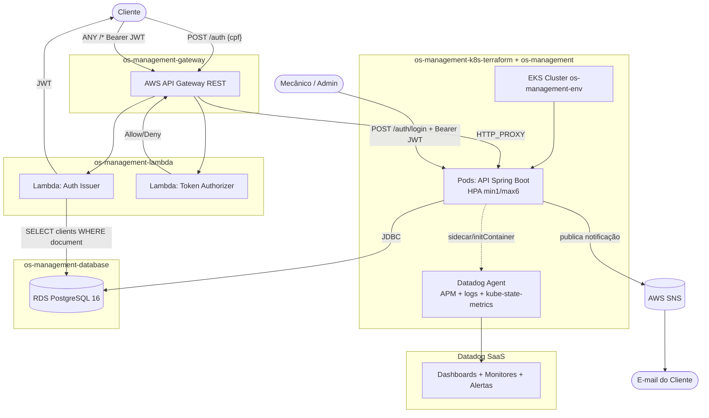
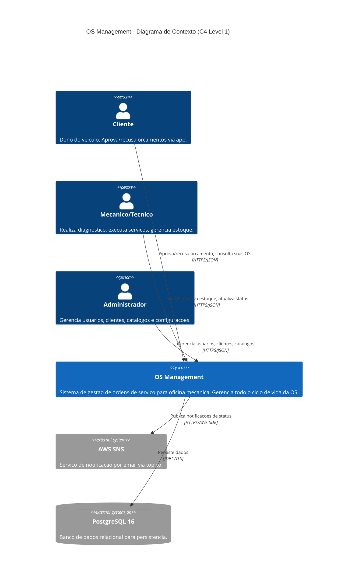
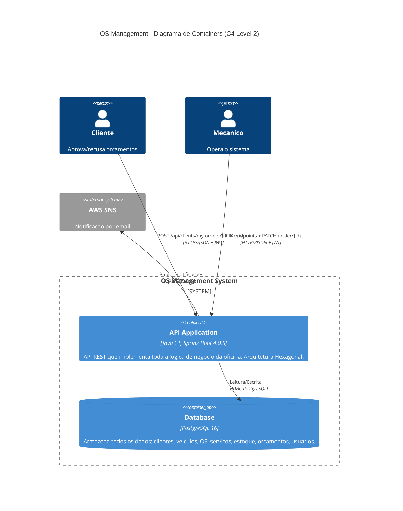
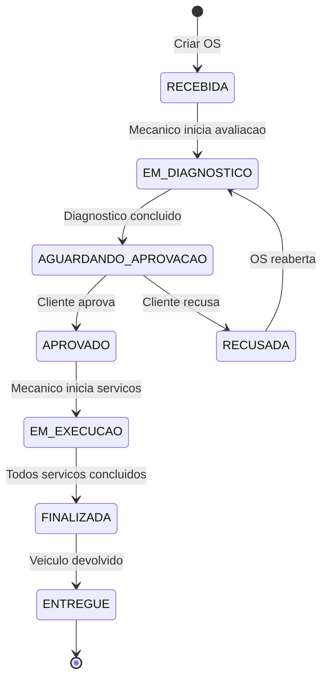
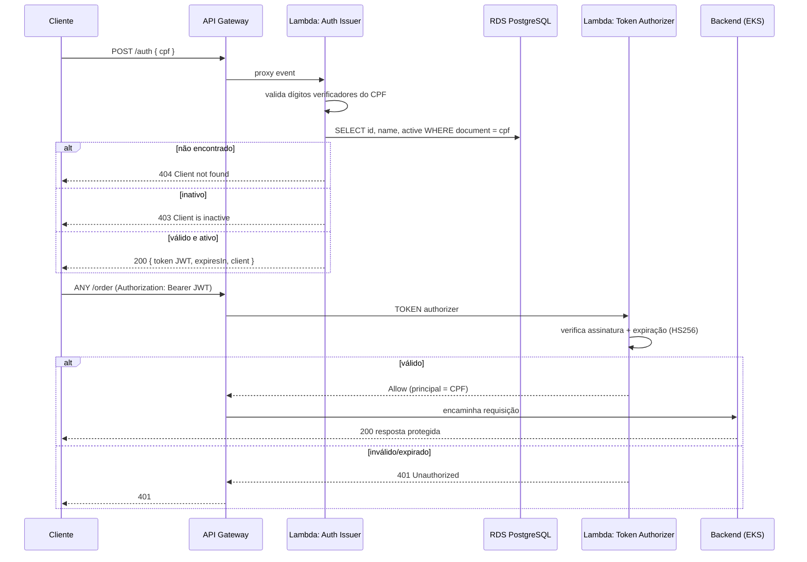
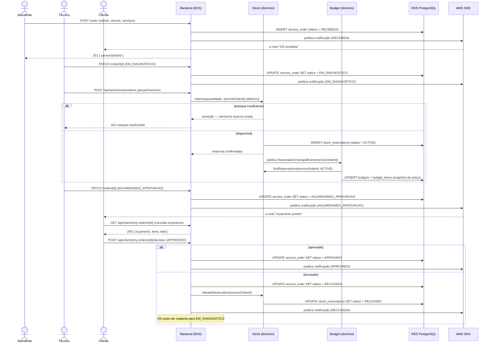

# Desenho da Arquitetura — OS Management

> Ver também: [RFCs](rfc/README.md) (decisões técnicas avaliadas) e
> [ADRs](adr/README.md) (decisões arquiteturais permanentes).

## Visão Consolidada da Solução (Multi-Repositório)

O sistema é composto por 5 repositórios com ciclos de deploy independentes
(ver [ADR-0003](adr/ADR-0003-split-multiplos-repositorios.md)). O diagrama
abaixo mostra a visão de nuvem completa — API Gateway, funções serverless de
autenticação, cluster Kubernetes, banco gerenciado e observabilidade — algo
que os diagramas C4 da seção seguinte não cobrem sozinhos, pois eles têm
zoom apenas no container da aplicação principal.



#### Descrição dos Componentes por Repositório

| Repositório | Componente no diagrama | Papel na solução |
|---|---|---|
| `os-management-gateway` | AWS API Gateway | Porta de entrada pública para o cliente final; roteia `/auth` ao issuer e `/*` ao backend via authorizer |
| `os-management-lambda` | Lambda Auth Issuer + Token Authorizer | Emite e valida o JWT de CPF (ver [RFC-0003](rfc/RFC-0003-estrategia-autenticacao.md)) |
| `os-management-k8s-terraform` | EKS Cluster + metrics-server | Cluster gerenciado onde a aplicação roda; base para o HPA (ver [ADR-0002](adr/ADR-0002-uso-hpa.md)) |
| `os-management` | Pods da API + manifests K8s | Lógica de negócio, autenticação de staff, orquestração dos fluxos de OS |
| `os-management-database` | RDS PostgreSQL | Banco gerenciado único, consumido pela API e pela Lambda issuer (ver [RFC-0002](rfc/RFC-0002-escolha-banco-dados.md) e o [diagrama ER](../../os-management-database/README.md#modelagem-do-banco-de-dados)) |
| — | Datadog Agent + SaaS | Observabilidade: latência de API, CPU/memória dos pods, healthchecks/uptime, logs estruturados correlacionados, métricas de negócio (ver `os-management/datadog/README.md`) |

---

## C4 Model

### Nivel 1 — Context Diagram (Diagrama de Contexto)

Mostra o sistema OS Management e suas interacoes com atores externos.



#### Descricao dos Elementos

| Elemento | Tipo | Descricao |
|----------|------|-----------|
| Cliente | Pessoa | Dono do veiculo. Recebe notificacoes por email. Aprova ou recusa orcamentos via endpoint autenticado. |
| Mecanico/Tecnico | Pessoa | Profissional da oficina. Cria OS, realiza diagnostico, reserva pecas, executa servicos, atualiza status. |
| Administrador | Pessoa | Gerencia usuarios, clientes, veiculos, catalogos de pecas/insumos e configuracoes do sistema. |
| OS Management | Sistema | Aplicacao principal. API REST Spring Boot que gerencia todo o ciclo de vida da OS. |
| AWS SES | Sistema Externo | Servico da AWS para envio de emails HTML com notificacoes de mudanca de status. |
| PostgreSQL 16 | Banco de Dados | Armazena clientes, veiculos, OS, servicos, estoque, orcamentos, usuarios. |

---

### Nivel 2 — Container Diagram (Diagrama de Containers)

Mostra os containers (unidades de deploy) que compoem o sistema e suas interacoes.



#### Descricao dos Containers

| Container | Tecnologia | Responsabilidade |
|-----------|-----------|-----------------|
| API Application | Java 21, Spring Boot 4.0.5, Docker (non-root) | Toda a logica de negocio. Autenticacao JWT. Validacao. Orquestracao de fluxos. |
| Database | PostgreSQL 16, Docker | Persistencia relacional. Integridade referencial. Transacoes ACID. |
| AWS SNS | Servico gerenciado AWS | Publicacao de notificacoes de status para subscribers (email). |

---

## Componentes da Aplicacao (dentro do Container API)

### Arquitetura Hexagonal — Camadas

```
+------------------------------------------------------------------+
|                      ADAPTER IN (Web/REST)                        |
|                                                                  |
|  Controllers: Client, ServiceOrder, Vehicle, Part, Supply,       |
|  Stock, Service, Budget, Monitoring, User                        |
|  DTOs: Request/Response records                                  |
+------------------------------------------------------------------+
                              |
                              v
+------------------------------------------------------------------+
|                    APPLICATION (Use Cases)                        |
|                                                                  |
|  Use Cases: CreateOrder, UpdateOrder, DecideOrder, ListOrders,   |
|  FindOrdersByDocument, CreateClient, ReserveStock, etc.          |
|  Event Listeners: BudgetEventListener, StockRejectionListener    |
|  Notification: OrderStatusNotificationService                    |
|  Port Interfaces (OUT): ClientRepository, ServiceOrderRepository,|
|  StockRepository, VehicleRepository, EmailNotificationPort       |
+------------------------------------------------------------------+
                              |
                              v
+------------------------------------------------------------------+
|                         DOMAIN                                   |
|                                                                  |
|  Entities: ServiceOrder (rich), Client, Vehicle, Stock, Budget   |
|  Value Objects: Document (CPF/CNPJ), LicensePlate                |
|  Enums: OrderServiceStatusEnum, Decision, DocumentType           |
|  Events: OrderRejectedEvent, ReservationChangedEvent             |
|  Exceptions: InvalidStatusTransitionException, ClientNotFound    |
+------------------------------------------------------------------+
                              |
                              v
+------------------------------------------------------------------+
|                    ADAPTER OUT (Persistence)                      |
|                                                                  |
|  Persistence Adapters: ClientPersistenceAdapter,                 |
|  ServiceOrderPersistenceAdapter, StockPersistenceAdapter, etc.   |
|  Mappers: ClientMapper, VehicleMapper, StockMapper (MapStruct)   |
+------------------------------------------------------------------+
                              |
                              v
+------------------------------------------------------------------+
|                     INFRASTRUCTURE                                |
|                                                                  |
|  JPA Entities: ClientEntity, ServiceOrderEntity, StockEntity...  |
|  Security: JwtFilter, JwtService, SecurityConfig                 |
|  Notification: SesEmailService, EmailTemplateRenderer, SesConfig |
|  Config: GlobalExceptionHandler, AsyncConfig                     |
+------------------------------------------------------------------+
```

### Modulos de Dominio

| Modulo | Responsabilidade | Entidades Principais |
|--------|-----------------|---------------------|
| ServiceOrder | Ciclo de vida da OS com maquina de estados | ServiceOrder, OrderServiceStatusEnum, Decision |
| Client | Cadastro de clientes com CPF/CNPJ | Client, Document, Cpf, Cnpj |
| Vehicle | Cadastro de veiculos | Vehicle, LicensePlate, VehicleType |
| Product | Catalogo de pecas e insumos | Product (abstract), Part, Supply |
| Stock | Controle de estoque e reservas | Stock, StockMovement, StockReservation |
| Budget | Orcamento automatico | Budget, BudgetItem |
| Service | Servicos dentro da OS | WorkshopService, ServiceType, Status |
| Monitoring | Metricas de performance | ServiceAverageTime, AverageTimeEnum |
| User | Autenticacao e autorizacao | User, Role, Group |
| Notification | Envio de emails | EmailNotificationPort, SesEmailService |

### Fluxo Principal — Ciclo de Vida da OS



### Comunicacao entre Componentes

| Origem | Destino | Mecanismo | Descricao |
|--------|---------|-----------|-----------|
| DecideOrderUseCase | StockRejectionEventListener | Spring Event (sincrono) | Ao recusar, publica OrderRejectedEvent |
| StockRejectionEventListener | ReleaseReservationUseCase | Chamada direta | Libera reservas ACTIVE da OS |
| ReserveStockUseCase | BudgetEventListener | Spring Event (sincrono) | Ao reservar, publica ReservationChangedEvent |
| BudgetEventListener | RecalculateBudgetUseCase | Chamada direta | Recalcula orcamento |
| UpdateOrderUseCase | OrderStatusNotificationService | Chamada direta | Notifica cliente |
| OrderStatusNotificationService | SesEmailService | Via port interface (@Async) | Envia email de forma assincrona |

### Seguranca

| Aspecto | Implementacao |
|---------|--------------|
| Autenticacao | JWT stateless (Bearer token) |
| Autorizacao | Role-based (ADMIN, TECHNICIAN, USER) |
| Ownership | Email JWT -> Client -> Document == OS.cpfCnpj |
| Container | Usuario non-root no Dockerfile |
| Endpoints publicos | /auth/login, /swagger-ui/**, /v3/api-docs/** |
| Endpoints cliente | /api/clients/my-orders/** (ROLE_USER) |
| Demais endpoints | ROLE_ADMIN ou ROLE_TECHNICIAN |

---

## Diagramas de Sequência

### Autenticação via CPF

Fluxo completo de emissão e validação do JWT de cliente (API Gateway →
Lambda issuer/authorizer → backend). Diagrama detalhado e mantido como fonte
única em [`os-management-lambda/README.md § Authentication sequence`](../../os-management-lambda/README.md#authentication-sequence);
resumo abaixo para referência rápida:



### Abertura de Ordem de Serviço

Fluxo de negócio desde a criação da OS até a aprovação do orçamento pelo
cliente, cobrindo a máquina de estados descrita em
[`README.md § Fluxo Principal da Ordem de Servico`](../README.md#fluxo-principal-da-ordem-de-servico-maquina-de-estados)
e as regras de [Reserva de Estoque](../../os-tech-documentation/02%20-%20Regras%20de%20Negocio/Reserva%20de%20Estoque.md)
e [Orçamento](../../os-tech-documentation/02%20-%20Regras%20de%20Negocio/Orcamento.md).


